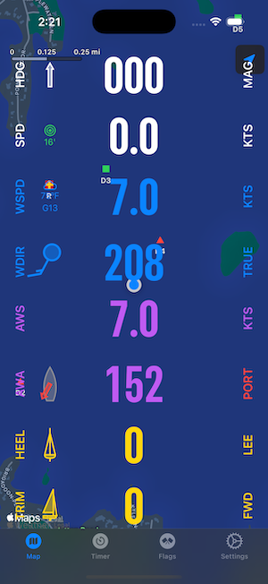
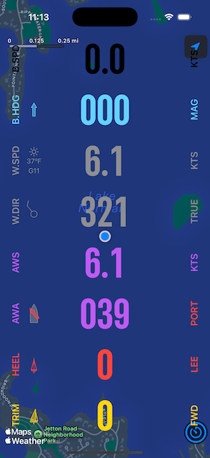
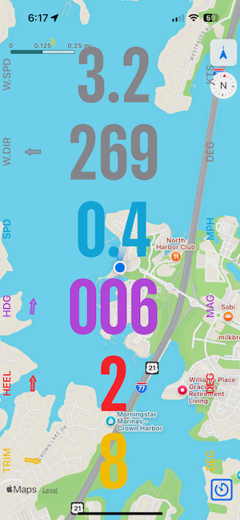
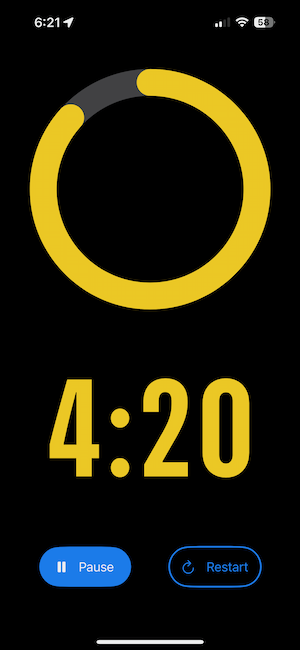
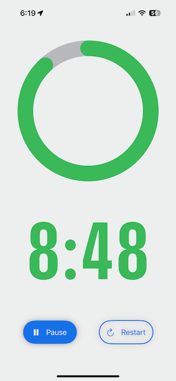
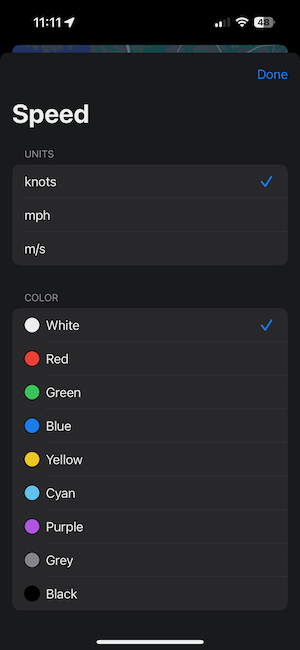
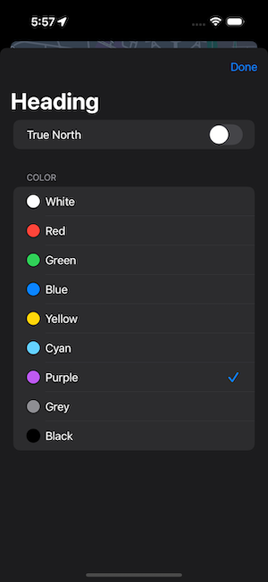
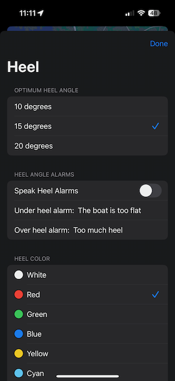
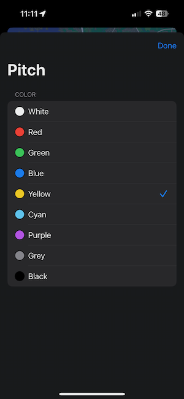
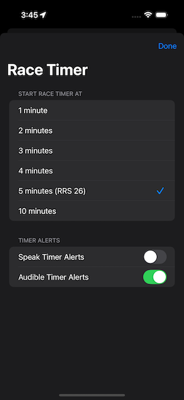

I wrote this IOS Navigation application to learn SwiftUI. I use the application on my iPhone as a navigation 
aid while sailing my MC Scow dingy. I have the phone mounted vertically so I can use it as a compass, 
knotmeter, and heel and pitch monitor.

### Main Screen
The initial user interface displays a map, a compass icon, map scale and user location with heading. Overlaid 
on the map are various instruments:
- Wind Speed
- Wind Direction
- Boat Speed
- Current Heading / Direction of movement
- The Heel angle
- The Pitch angle
- Apparent wind speed
- Apparent wind angle

Some instruments have a graphical indicator. Heading uses an arrow to indicate the boat heading relative to 
true or magnetic north. Wind Direction has a Beaufort Scale indicator showing the wind strength, direction and cloud cover. Wind Speed has a general weather indicator (per whatever AppleWeather says; cloudy, windy, etc.) and a wind gust measure.
The Heel indicator depicts a boat viewed from the stern and it rotates per the angle of heel. Similarly, the 
trim, or pitch indicator is a side view of a boat and it rotates depicting the pitch of the boat. Apparent 
wind angle uses an arrow and depicts the current wind angle relative to the bow of the boat.

The user can use a drag gesture left or right through a number of preset layouts with different instruments 
overlaid on the map. As the drag gesture is used, there is an indication of which layout you are switching to.

Wind speed and direction are from the Apple WeatherKit service. Boat speed and Heading are from CoreLocation. 
Heel and pitch are derived from CoreMotion. Apparent wind speed and angle are derived from the current 
forecast weather, boat speed and heading.

| Main Screen Dark | Main Screen Dark 2| Main Screen Light |
| ---------------- | ---------------- | ----------------- |
|  | |  |

A tap on the stopwatch icon in the lower right will bring up the stopwatch. The stopwatch can be started, 
paused and reset using the buttons. Announcements are made at various times as to how much time is left 
before the start of the race. The stopwatch can be dismissed with a left or right drag gesture and will 
return to the instrument view. The stopwatch will continue to run in the background.

| StopWatch Dark | StopWatch Light |
| -------------- | --------------- |
|  |  |

A double tap gesture on any of the instruments will bring up the settings screen for that instrument. This 
also goes for the stopwwatch.
| Speed settings | Heading Settings |
| -------------- | ---------------- |
|  |  |


| Heel settings | Pitch Settings |
| -------------- | ---------------- |
|  |  |

| StopWatch settings |
| -------------------|
|  |

## Technical Design Details

The application design uses a few design patterns, principally Observer, State and Environment. SwiftUI 
development imposes the use of these behavioral and creational patterns.

### Observer
The application uses CoreLocation and CoreMotion to track the location of the device, its movement and 
orientation. This is where the managers, or services use the Observer pattern. Apple Weaather is used to 
retrieve the current forecast based on the current location of the device.
#### LocationManager
The LocationManager uses CoreLocation to publish properties that describe the location and heading of the 
device
```swift
@Observable
class LocationManager: NSObject, CLLocationManagerDelegate {
    var speed: Double = 0.0
    var trueHeading: Double = 0
    var magneticHeading: Double = 0
    var heading: CLHeading?
    var userLocation: CLLocation?
    var isAuthorized = false
    ...
}
```
The properties of LocationManager are calculated within the LocationManager implementation and they are 
subscribed to by various Views within the application. This is achieved via injecting the LocationManager 
into the application environment by the SailorApp.
```swift
struct SailingApp: App {
    @State private var locationManager = LocationManager()
    ...
    var body: Some Scene {
        WindowGroup {
            ...
        }
        .environment(locationManager)
    }
}
```
As the LocationManager is injected into the environment, View classes subscribe to publications of the 
LocationManager by using the @Environment annotation:
```swift
struct SpeedView: View {
    @Environment(LocationManager.self) var locationManager
    ...
    var body: some View {
        ...
    }
    private var convertedSpeed: Double {
        return settings.convertSpeed(speed: locationManager.speed)
    }
}
```
#### MotionManager
The MotionManager uses CMMotionManager to publish properties that describe the movement or rotation of 
the device
```swift
@Observable
class MotionManager {
    var rollAngle: Double = 0
    var yawAngle: Double = 0
    var pitchAngle: Double = 0
    ...
}
```
The properties of MotionManager are calculated within the MotionManager implementation and they are 
subscribed to by various Views within the application. This is achieved via injecting the MotionManager 
into the application environment by the SailorApp.
```swift
struct SailingApp: App {
    @State private var MotionManager = MotionManager()
    ...
    var body: Some Scene {
        WindowGroup {
            ...
        }
        .environment(motionManager)
    }
}
```
As the MotionManager is injected into the environment, View classes can subscribe to publications of the 
MotionManager by using the @Environment annotation:
```swift
struct HeelAngleView: View {
    @Environment(MotionManager.self) var motionManager
    ...

    var body: some View {
        InstrumentView(
            instrumentName: "HEEL",
            ...
        )
        ...       
    }
}
```
#### WeaatherManager
The WeatherManager uses CoreLocation to get the current location of the device, and then uses Apple Weaather 
to periodically fetch the current weather forecast which includes wind speed and direction.
```swift
@Observable
class WeatherManager: NSObject, CLLocationManagerDelegate {
    private let fiveMinutes: TimeInterval = 5 * 60
    private let weatherManager = WeatherService()
    private let locationManager = CLLocationManager()
    var windSpeed: Double = 0.0
    var windDirection: Double = 0.0
    var isAuthorized = false
    ...
}
```
The properties of WeatherManager are calculated within the WeatherManager implementation and they are 
subscribed to by various Views within the application. This is achieved via injecting the WeatherManager 
into the application environment by the SailorApp.
```swift
@main
struct SailingApp: App {
    ...
    @State private var weatherManager = WeatherManager()
    ...
    var body: Some Scene {
        WindowGroup {
            ...
        }
        .environment(weatherManager)
    }
}
```
As the WeatherManager is injected into the environment, View classes can subscribe to publications of the 
WeaatherManager by using the @Environment annotation:
```swift
struct ApparentWindSpeedView: View {
    @Environment(WeatherManager.self) var weatherManager
    ...
    var body: some View {
        let windSpeed = apparentWindSpeed
        InstrumentView(
            instrumentName: "AWS",
        ...
    }
```
### State
The Views maintain a variety of state properties such as, color, trueNorth, Heel angle limits, etc. When 
these properties are modified by the user, the view reacts to the change and updates itself, e.g. with the 
HeelAngleView:
```swift
struct HeelAngleView: View {
    @Environment(MotionManager.self) var motionManager
    @StateObject private var settings = HeelAngleSettings.shared
    @State private var isPickerPresented: Bool = false
    ...

    var body: some View {
        ...
    }
}
```
I use a Singleton pattern to gather view settings into a Settings class. This is a simple way to manage all 
related settings of a view. The default settings are in code, backed by the use of UserDefaults and Root.plist
 through @AppStorage. This allows changes to settings from the IOS Settings application and by Views within 
 the application and these settings are stored automatically and restored when the application is restarted.
```swift
class HeelAngleSettings: Settings, ColorProtocol {
    let optimumHeelAngles = [10, 15, 20]
    
    static var shared = HeelAngleSettings()
    @AppStorage(wrappedValue: 1, "preference_heelColor") var colorIndex: Int
    @AppStorage(wrappedValue: 2, "preference_optimumHeelColor") var optimumHeelColorIndex: Int
    @AppStorage(wrappedValue: false, "preference_speakHeelAlarms") var speakHeelAlarms: Bool
    @AppStorage(wrappedValue: "The boat is too flat", "preference_underHeelAlarm") var underHeelAlarm: String
    @AppStorage(wrappedValue: "Too much heel", "preferences_overHeelAlarm") var overHeelAlarm: String
    @AppStorage(wrappedValue: 15, "preference_optimumHeelAngle") var optimumHeelAngle: Int
    ...
}
```
## Tweaks and Adjustments
CoreLocation and CoreMotion deliver updates to location and movement frequently and to the Nth decimal place. 
While you can request for less accuracy and less frequent updates, I found it easier and more predictable to 
control when updates are published from locationManager and motionManager. I have no need for accuracy for 
heading, heel and pitch better than unit degrees, and no better than 1 decimal place for speed. Thus you see 
in locationManager rounding of speed and publishing only if the value has changed from the prior:
```swift
func locationManager(_ manager: CLLocationManager, didUpdateLocations locations: [CLLocation]) {
    userLocation = locations.last
    if let location = locations.last {
        var newSpeed = location.speed > 0 ? location.speed : 0.0
        newSpeed = round(newSpeed * 10) / 10
        if (newSpeed != speed) {
            speed = newSpeed
        }
    }
}
```
Similarly in MotionManager, only publish new Roll, Yaw and Pitch angles if they have changed:
```swift
    private func setupMotionManager() {
        if motionManager.isDeviceMotionAvailable {
            motionManager.deviceMotionUpdateInterval = 0.2
            motionManager.startDeviceMotionUpdates(to: .main) { [weak self] (motion, error) in
                guard let self = self, let motion = motion else { return }
                let gravity = motion.gravity
                let xSquared = gravity.x * gravity.x
                let ySquared = gravity.y * gravity.y
                let zSquared = gravity.z * gravity.z
                
                let xTiltAngle: Double = atan2(sqrt(ySquared + zSquared), gravity.x) * (180 / .pi)
                let yTiltAngle: Double = atan2(sqrt(xSquared + zSquared), gravity.y) * (180 / .pi)
                let zTiltAngle: Double = atan2(sqrt(xSquared + ySquared), gravity.z) * (180 / .pi)
                
                // Reduce accuracy to 1 degree
                let newRollAngle = 90.0 - round(xTiltAngle)
                let newYawAngle = round(yTiltAngle)
                let newPitchAngle = round(zTiltAngle) - 90.0
                
                // Don't publish new values if they have not changed
                if (newRollAngle != self.rollAngle) {
                    self.rollAngle = newRollAngle
                }
                if (newYawAngle != self.yawAngle) {
                    self.yawAngle = newYawAngle
                }
                if (newPitchAngle != self.pitchAngle) {
                    self.pitchAngle = newPitchAngle
                }
            }
        }
    }
```
WeatherManager uses WeatherKit for current wind speed and direction. The weather forecast depends on location
and does not change frequently. I use another instance of location manager but stop tracking in between the
five minute updates. As Apple Weaather is an asynchronous service (weatherManager.weather is async), I use a 
Task and await the fetchWeather() function. Apple Weather is a fee-for-service which is free for up to 
500,000 calls per month. The application calls the weather service every 5 minutes (or approximately 9000 
times a month). If my usage is typical, and I use the application about 10 hours per week, the free Weather 
Service would support about 4,100 users.
```swift
@Observable
class WeatherManager: NSObject, CLLocationManagerDelegate {
    private let fiveMinutes: TimeInterval = 5 * 60
    private let weatherManager = WeatherService()
    private let locationManager = CLLocationManager()
    var windSpeed: Double = 0.0
    var windDirection: Double = 0.0
    var isAuthorized = false

    override init() {
        super.init()
        print("weather manager initialized")
        locationManager.delegate = self
        startLocationServices()
        _ = Timer.scheduledTimer(withTimeInterval: fiveMinutes, repeats: true) { _ in
            self.startTracking()
        }
    }
    ...
    func fetchWeather(for location: CLLocation) async {
        do {
            let weather = try await weatherManager.weather(for: location)
            let newWindSpeed = round((weather.currentWeather.wind.speed.value > 0 ? weather.currentWeather.wind.speed.value : 0.0) * 10) / 10
            windSpeed = newWindSpeed
            
            let newWindDirection: Int = Int(round(weather.currentWeather.wind.direction.value)) % 360
            windDirection = Double(newWindDirection)
        }
        ...
        stopTracking()
    }
    ...
    func locationManager(_ manager: CLLocationManager, didUpdateLocations locations: [CLLocation]) {
        guard let location = locations.last else { return }
        Task {
            await fetchWeather(for: location)
        }
    }
}
```
