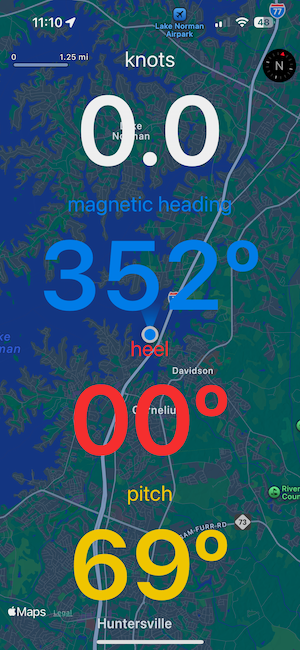
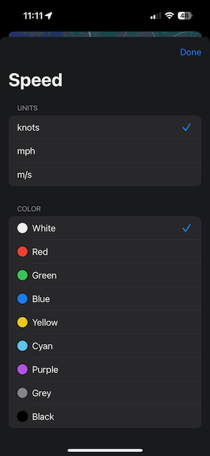
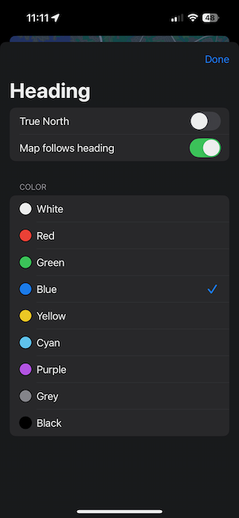
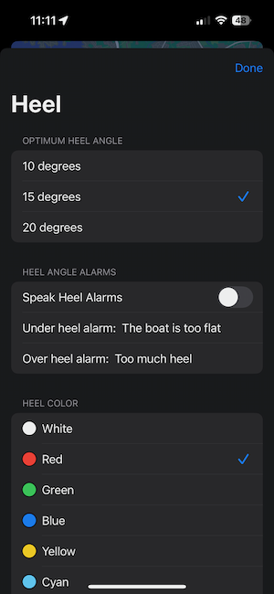
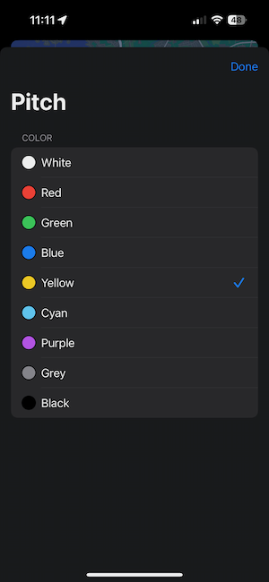

I wrote this IOS Navigation application to learn SwiftUI. I use the application on my iPhone as a navigation aid while sailing my MC Scow dingy. I have the phone mounted vertically so I can use it as a compass, knotmeter, and heel and pitch monitor.

The user interface presented is a map with four views superimposed that display information:
- Speed in knots, mph or m/s
- Heading, true or magentic north
- Heel angle
- Pitch angle

### Main Screen
The primary user interface displays the map, a compass icon, map scale and user location with heading. Overlaid on the map are the speed the device is moving, the magnetic or true heading, the degrees of heel (or tilt) and pitch of the device from vertical.

A tap gesture on each of the four metrics will bring up the settings screen for that metric
| Speed settings | Heading Settings |
| -------------- | ---------------- |
|  |  |

| Heel settings | Pitch Settings |
| -------------- | ---------------- |
|  |  |

