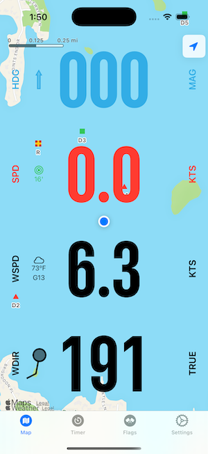

I wrote this IOS Navigation application to learn SwiftUI. I use the application on my iPhone as a navigation aid while sailing my MC Scow dingy. I have the phone mounted vertically so I can use it as a compass, knotmeter, and heel and pitch monitor.


### Main Screen
The initial user interface displays a map, a compass icon, map scale and user location with heading. Overlaid on the map are various instruments:
- Wind Speed
- Wind Direction
- Boat Speed
- Current Heading / Direction of movement
- The Heel angle
- The Pitch angle

The user can swipe left or right through a number of preset layouts with different instruments overlaid on the map.

Wind speed and direction are from the Apple WeatherKit service. Boat speed and Heading are from CoreLocation. Heel and pitch are derived from CoreMotion.

| Main Screen Dark | Main Screen Light | StopWatch Screen |
| ---------------- | ----------------- | ---------------- |
|  |  |  |

A double tap gesture on any of the instruments will bring up the settings screen for that instrument
| Speed settings | Heading Settings |
| -------------- | ---------------- |
|  |  |


| Heel settings | Pitch Settings |
| -------------- | ---------------- |
|  |  |

## Technical Design Details

The application design uses a few design patterns, principally Observer, State and Environment. SwiftUI development relies on these behavioral and creational patterns as a defacto standard.

### Observer
The application uses CoreLocation and CoreMotion to track the location of the device, its movement and orientation. This is where the two managers, or services use the Observer pattern.
#### LocationManager
The LocationManager uses CoreLocation to publish properties that describe the location and heading of the device
```swift
@Observable
class LocationManager: NSObject, CLLocationManagerDelegate {
    var speed: Double = 0.0
    var trueHeading: Double = 0
    var magneticHeading: Double = 0
    var heading: CLHeading?
    var userLocation: CLLocation?
    var isAuthorized = false
    ...
}
```
The properties of LocationManager are calculated within the LocationManager implementation and they are subscribed to by various Views within the application. This is achieved via injecting the LocationManager into the application environment by the SailorApp.
```swift
struct SailorApp: App {
    @State private var locationManager = LocationManager()
    ...
    var body: Some Scene {
        WindowGroup {
            ...
        }
        .environment(locationManager)
    }
}
```
As the LocationManager is injected into the environment, View classes can subscribe to publications of the LocationManager by using the @Environment annotation:
```swift
struct SpeedView: View {
    @Environment(LocationManager.self) var locationManager
    ...
    var body: some View {
        Text("\(convertedSpeed, specifier: "%.1f")")
        ...
    }
    private var convertedSpeed: Double {
        return settings.convertSpeed(speed: locationManager.speed)
    }
}
```
#### MotionManager
The MotionManager uses CMMotionManager to publish properties that describe the movement or rotation of device
```swift
@Observable
class MotionManager {
    var rollAngle: Double = 0
    var yawAngle: Double = 0
    var pitchAngle: Double = 0
    ...
}
```
The properties of MotionManager are calculated within the MotionManager implementation and they are subscribed to by various Views within the application. This is achieved via injecting the MotionManager into the application environment by the SailorApp.
```swift
struct SailorApp: App {
    @State private var MotionManager = MotionManager()
    ...
    var body: Some Scene {
        WindGroup {
            ...
        }
        .environment(motionManager)
    }
}
```
As the MotionManager is injected into the environment, View classes can subscribe to publications of the MotionManager by using the @Environment annotation:
```swift
struct HeelAngleView: View {
    @Environment(MotionManager.self) var motionManager
    ...
    var body: some View {
        Text("\(convertedHeel, specifier: "%02d")º")
        ...
    }

    private var convertedHeel: Int {
        var tilt: Int = 0
        switch UIDevice.current.orientation {
            // calculate tilt based on orientation of device on 3 axes
            ...
        }
        return tilt
    }
}
```
### State
The Views maintain a variety of state properties such as, color, trueNorth, Heel angle limits, etc. When these properties are modified by the user, the view reacts to the change and updates itself, e.g. with the HeelAngleView:
```swift
struct HeelAngleView: View {
    ...
    @StateObject private var settings = HeelAngleSettings.shared
    ...
    var body: some View {
        VStack() {
            Text("heel")
                .font(.title)
                .foregroundColor(settings.titleColor)
                ...
        }
    }
}
```
I use a Singleton pattern to gather view settings into a Settings class. This is a simple way to manage all related settings of a view. The default settings are in code, backed by the use of UserDefaults and Root.plist through @AppStorage. This allows changes to settings from the IOS Settings application and by Views within the application and these settings are stored automatically and restored when the application is restarted.
```swift
class HeelAngleSettings: Settings, ColorProtocol {
    let optimumHeelAngles = [10, 15, 20]
    
    static var shared = HeelAngleSettings()
    @AppStorage(wrappedValue: 1, "preference_heelColor") var colorIndex: Int
    @AppStorage(wrappedValue: 2, "preference_optimumHeelColor") var optimumHeelColorIndex: Int
    @AppStorage(wrappedValue: false, "preference_speakHeelAlarms") var speakHeelAlarms: Bool
    @AppStorage(wrappedValue: "The boat is too flat", "preference_underHeelAlarm") var underHeelAlarm: String
    @AppStorage(wrappedValue: "Too much heel", "preferences_overHeelAlarm") var overHeelAlarm: String
    @AppStorage(wrappedValue: 15, "preference_optimumHeelAngle") var optimumHeelAngle: Int
    ...
}
```
## Tweaks and Adjustments
Both CoreLocation and CoreMotion deliver updates to location and movement frequently and to the Nth decimal place. While you can request for less accuracy and less frequent updates, I found it easier and more predictable to control when updates are published from locationManager and motionManager. I have no need for accuracy for heading, heel and pitch better than unit degrees, and no better than 1 decimal place for speed. Thus you see in locationManager rounding of speed and publishing only if the value has changed from the prior:
```swift
func locationManager(_ manager: CLLocationManager, didUpdateLocations locations: [CLLocation]) {
    userLocation = locations.last
    if let location = locations.last {
        var newSpeed = location.speed > 0 ? location.speed : 0.0
        newSpeed = round(newSpeed * 10) / 10
        if (newSpeed != speed) {
            speed = newSpeed
        }
    }
}
```
Similarly in MotionManager, only publish new Roll, Yaw and Pitch angles if they have changed:
```swift
    private func setupMotionManager() {
        if motionManager.isDeviceMotionAvailable {
            motionManager.deviceMotionUpdateInterval = 0.2
            motionManager.startDeviceMotionUpdates(to: .main) { [weak self] (motion, error) in
                guard let self = self, let motion = motion else { return }
                let gravity = motion.gravity
                let xSquared = gravity.x * gravity.x
                let ySquared = gravity.y * gravity.y
                let zSquared = gravity.z * gravity.z
                
                let xTiltAngle: Double = atan2(sqrt(ySquared + zSquared), gravity.x) * (180 / .pi)
                let yTiltAngle: Double = atan2(sqrt(xSquared + zSquared), gravity.y) * (180 / .pi)
                let zTiltAngle: Double = atan2(sqrt(xSquared + ySquared), gravity.z) * (180 / .pi)
                
                // Reduce accuracy to 1 degree
                let newRollAngle = 90.0 - round(xTiltAngle)
                let newYawAngle = round(yTiltAngle)
                let newPitchAngle = round(zTiltAngle) - 90.0
                
                // Don't publish new values if they have not changed
                if (newRollAngle != self.rollAngle) {
                    self.rollAngle = newRollAngle
                }
                if (newYawAngle != self.yawAngle) {
                    self.yawAngle = newYawAngle
                }
                if (newPitchAngle != self.pitchAngle) {
                    self.pitchAngle = newPitchAngle
                }
            }
        }
    }
```
WeatherManager uses WeatherKit for current wind speed and direction. These values don't change frequently, and obviously weather depends on currrent location, so I use another instance of location manager but stop tracking in between the five minute updates:
```swift
@Observable
class WeatherManager: NSObject, CLLocationManagerDelegate {
    private let fiveMminutes: TimeInterval = 5 * 60
    private let weatherManager = WeatherService()
    private let locationManager = CLLocationManager()
    var windSpeed: Double = 0.0
    var windDirection: Double = 0.0
    var isAuthorized = false

    override init() {
        super.init()
        print("\(Date().toTimestamp) -  \(#file) \(#function) weather manager initialized")
        locationManager.delegate = self
        startLocationServices()
        _ = Timer.scheduledTimer(withTimeInterval: fiveMminutes, repeats: true) { _ in
            self.startTracking()
        }
    }
    ...
    func fetchWeather(for location: CLLocation) async {
        do {
            let weather = try await weatherManager.weather(for: location)
            let newWindSpeed = round((weather.currentWeather.wind.speed.value > 0 ? weather.currentWeather.wind.speed.value : 0.0) * 10) / 10
            windSpeed = newWindSpeed
            
            let newWindDirection: Int = Int(round(weather.currentWeather.wind.direction.value)) % 360
            windDirection = Double(newWindDirection)
            print("\(Date().toTimestamp) -  \(#file) \(#function) weather updated windSpeed: \(windSpeed), windDirection: \(windDirection)")
        }
        catch {
            print("\(Date().toTimestamp) -  \(#file) \(#function) failed to fetch weather: \(error)")
        }
        print("\(Date().toTimestamp) -  \(#file) \(#function) stop tracking")
        stopTracking()
    }
```
